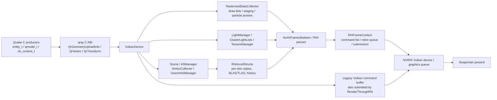

# Agent architecture index

Start here to locate code, not to learn the engine from scratch. Read [PERFORMANCE.md](PERFORMANCE.md) for measured costs, binary identities and capture locations before proposing an optimization.

**Verified source snapshot:** `2491c038`, 2026-10-10. This snapshot includes entity profiling, exact brush-transform reuse, SIMD bounds and the staged cluster pipeline; it is not an assertion about master or another worktree. Function names are the durable lookup keys; `#L` links identify their locations at this snapshot. Recheck a changed function and its immediate caller/callee, not the entire repository.

Engine MCP use is mandatory for all agents under [AGENTS.md](AGENTS.md#mandatory-engine-mcp-workflow).
Start with `quakeray.server_status`, then use scoped `find_symbol` (`query`, `file`) and the available
reference/call tools. Confirm source identities and returned locations against this worktree; retain
diagnostics and partial coverage. File/IDE inspection supplements these tools only where coverage is
missing, with an explicit fallback reason. Do not assume another open project's index describes this branch.

## Task routing

| Question | Start at | Next boundary |
| --- | --- | --- |
| Where does a frame spend CPU time? | [CPU execution graph](#cpu-execution-graph), [performance contract](PERFORMANCE.md#measurement-contract) | Producer slots versus `qrDrawFrame` phases; do not mix nested timers. |
| Why are entities expensive? | [Geometry upload paths](#geometry-upload-paths) | Brush/alias preparation → `Scene::Upload` → staging/metadata → RHI AS recording. |
| What runs on the GPU? | [GPU execution graph](#gpu-execution-graph), [GPU pass index](#gpu-pass-index) | `NvrhiFrameSkeleton::Render`, then only the implicated pass/shader. |
| Is something culled? | [Visibility facts](#visibility-facts) | World marking, entity rejection and RT instance masks are different mechanisms. |
| Is the CPU waiting for the GPU/display? | [Synchronization and lifetime](#synchronization-and-lifetime) | Begin-frame fence/acquire, RHI slot reuse, queue submission, present. |
| Where do assets, gameplay, UI or audio enter? | [Subsystem index](#subsystem-index) | Open the named entry point before expanding the search. |

## Coarse frame map

```text
Game: main → Host_Frame → _Host_Frame
 ├─ Input / commands / network polling
 ├─ Server simulation ticks: Host_ServerFrame → SV_Physics → QuakeC
 ├─ Client update: CL_ReadFromServer → CL_RelinkEntities / CL_UpdateTEnts
 ├─ Screen frame: SCR_UpdateScreen
 │   ├─ Begin renderer frame: fence / swapchain acquire / collector reset
 │   ├─ View setup and visibility / texture chaining
 │   ├─ CPU render-scene producers
 │   │   ├─ Static world submission / light recollection when dirty
 │   │   ├─ Sky, water and animated world surfaces
 │   │   ├─ Opaque entities, then alpha entities
 │   │   ├─ Smoke, classic particles and FTE particles
 │   │   ├─ Viewmodel + lights + teleports
 │   │   └─ Cluster prepare → top-up slices → finish + publication
 │   ├─ HUD / menu / editor / statistics geometry
 │   └─ qrDrawFrame → NVRHI RT/raster/compute recording → submit / present
 └─ Post-screen classic particle/smoke simulation and audio update
```

This is not a conventional raster `depth → opaque → transparent → viewmodel` pipeline. CPU producers upload geometry; shared RT passes consume world, entities and weapon geometry together. Some transparent geometry, smoke and particles use a raster overlay inside composition.

## Frame entry points

| Boundary | Real entry point → next call |
| --- | --- |
| Process loop | [`main`, `Quake/main_sdl.c:54`](Quake/main_sdl.c#L54) → [`Host_Frame`, `Quake/host.c:1043`](Quake/host.c#L1043) → [`_Host_Frame`, `:911`](Quake/host.c#L911). |
| Screen / view | [`SCR_UpdateScreen`, `Quake/gl_screen.c:1149`](Quake/gl_screen.c#L1149) → [`V_RenderView`, `Quake/view.c:918`](Quake/view.c#L918) → [`R_RenderView`, `Quake/gl_rmain.c:1252`](Quake/gl_rmain.c#L1252). |
| Begin-frame API | [`GL_BeginRenderingTask`, `Quake/gl_vidsdl.c:2523`](Quake/gl_vidsdl.c#L2523) → `qrStartFrame` → [`VulkanDevice::StartFrame`, `:1158`](renderer/Source/VulkanDevice.cpp#L1158) → [`BeginFrame`, `:34`](renderer/Source/VulkanDevice.cpp#L34). |
| End-frame API | [`GL_EndRenderingTask`, `Quake/gl_vidsdl.c:2758`](Quake/gl_vidsdl.c#L2758), [call/profiler bracket around `qrDrawFrame`, `:3213`](Quake/gl_vidsdl.c#L3213) → [`VulkanDevice::DrawFrame`, `:1178`](renderer/Source/VulkanDevice.cpp#L1178). |
| Backend orchestration | [`VulkanDevice::RenderThroughRhi`, `:730`](renderer/Source/VulkanDevice.cpp#L730) → [`NvrhiFrameSkeleton::Render`, `:623`](renderer/Source/RHI/NvrhiFrameSkeleton.cpp#L623) → [`RhiFrameContext::EndSlot`, `:130`](renderer/Source/RHI/RhiFrameContext.cpp#L130) → [`Swapchain::Present`, `:306`](renderer/Source/Swapchain.cpp#L306). |

The C ABI is [renderer/Include/qray/qray.h](renderer/Include/qray/qray.h); its dispatch wrappers are [renderer/Source/qray.cpp](renderer/Source/qray.cpp). The renderer is [statically linked from `renderer/`](CMakeLists.txt#L233). `GL_*`/`gl_*` are inherited names, not evidence of an OpenGL backend. The [selected frame mode is `Traced`](renderer/Source/VulkanDevice_Init.cpp#L465).

## CPU execution graph

Order for an accepted, fully loaded game frame; conditional simulation ticks, map rebuilds and debug paths are abbreviated. **Render tasks are gated by `r_tasks`** (default `0`): [the `SCR_UpdateScreen` condition](Quake/gl_screen.c#L1162) enables the task path when workers are available, and the producer order then follows [the `R_RenderView` task branch](Quake/gl_rmain.c#L1281); the serial order below is [the non-task branch](Quake/gl_rmain.c#L1354). Workers must not touch shared non-atomic state: pose and scratch buffers are thread-local, geometry uploads take the device mutex, and profiler accumulators use a spinlock. The threading contract, the frame graph edges and the rules for adding producers are in [docs/multithreading.md](docs/multithreading.md).

```mermaid
flowchart TD
    host["_Host_Frame / Host_FilterTime"] --> previousEnd["GL_SynchronizeEndRenderingTask<br/>publish completed profiler window"]
    previousEnd --> input["Input, Cbuf_Execute, NET_Poll, CL_AccumulateCmd"]
    input --> simulation["CL_SendCmd / Host_ServerFrame / optional CSQC physics"]
    simulation --> client["CL_ReadFromServer / relink / temporary entities"]
    client --> screen["SCR_UpdateScreen / CPU frame timer begins"]
    screen --> beginFrame["GL_BeginRendering / qrStartFrame<br/>fence wait, acquire, dynamic collector reset"]
    beginFrame --> view["SCR_SetupFrame / V_RenderView / R_SetupViewBeforeMark<br/>cpu.setup"]
    view --> visibility["R_MarkSurfaces<br/>cpu.mark; collect static efrags and chains"]
    visibility --> world["R_DrawWorldTask<br/>cpu.world; static upload / light recollection when dirty"]
    world --> sky["R_DrawSkyAndWaterTask<br/>cpu.sky; includes water and animated surfaces"]
    sky --> entities["R_DrawEntitiesTask, sequential chunks<br/>cpu.ents"]
    entities --> alpha["R_DrawAlphaEntitiesTask<br/>cpu.alpha"]
    alpha --> particles["R_DrawParticlesTask<br/>cpu.particles; smoke + classic + FTE"]
    particles --> weapon["R_DrawViewModelTask<br/>cpu.viewmodel; vm_draw + lights + teleports"]
    weapon --> cluster["cluster_prepare_task → cluster_topup_task (16 slices) → cluster_finish_task → cluster_publish_task (16 slices) → cluster_commit_task<br/>clust lists / clust topup / clust upload / clust publish"]
    cluster --> gui["SCR_DrawGUI / S_ExtraUpdate / SCR_DrawDone"]
    gui --> backend["GL_EndRendering / qrDrawFrame<br/>cpu.qrDrawFrame; RHI recording / submissions / Present call"]
    backend --> screenEnd["RT_Prof_FrameEnd<br/>screen-end interval sample"]
    screenEnd --> tail["CL_RunParticles / R_SmokeUpdate / BGM_Update / S_Update / CL_DecayLights"]
    classDef wait fill:#fff0d6,stroke:#ab7100,color:#222
    class beginFrame wait
```



[`_Host_Frame`](Quake/host.c#L911) can run networking/server simulation at a different rate from rendering. Classic particle and smoke simulation runs [after `SCR_UpdateScreen`](Quake/host.c#L1008); FTE's draw path also advances particle state using [particle dt](Quake/r_part_fte.c#L6970). Do not move all simulation into a fictitious pre-render `WorldUpdate()` node.

## GPU execution graph

Recording order of [the normal traced branch](renderer/Source/RHI/NvrhiFrameSkeleton.cpp#L708) of `NvrhiFrameSkeleton::Render`. Nodes show actual `gpu.*` capture buckets; feature gates can skip work. Arrows describe resource/recording order, not a synchronized CPU/GPU latency trace.

```mermaid
flowchart TD
    setup["setup<br/>copies, static/dynamic BLAS, TLAS, uniform, normal preprocessing"] --> clouds["clouds / sky<br/>procedural clouds and shadows or raster sky"]
    clouds --> primary["primary<br/>shared scene RT visibility / G-buffer"]
    primary --> decals["decals, if present"]
    decals --> godrays["godrays<br/>optional shadow-map raster + input trace/filter"]
    godrays --> refract["reflrefr<br/>glass, water, portals; particle proxy queries"]
    refract --> reflected["reflgodr, if pending"]
    reflected --> gradient["gradient<br/>denoiser reprojection, if enabled"]
    gradient --> direct["direct<br/>lighting / shadow rays"]
    direct --> indirect["indirect<br/>GI / bounce rays"]
    indirect --> compose["compose<br/>denoise, interleave, exposure, checkerboard<br/>raster overlay: world/alpha + smoke + particles<br/>HDR, glass blur, bloom, prepare-final"]
    compose --> upscale["upscale<br/>FSR; TAAU fallback"]
    upscale --> post["post<br/>pre-UI post-upscale effects"]
    post --> ui["ui<br/>HUD / menu / editor / statistics geometry"]
    ui --> postui["postui<br/>CRT / wipe, if active"]
    postui --> present["present<br/>fullscreen draw into acquired swapchain image"]
```



The god-rays shadow map is [inside `godrays`, after primary](renderer/Source/RHI/NvrhiFrameSkeleton.cpp#L1060), not a universal pre-opaque shadow stage. Ray-traced shadows also occur inside lighting passes. The [overlay callback occurs between checkerboard and HDR/final preparation](renderer/Source/RHI/RhiRtComposePass.cpp#L2002); its GPU time belongs to `compose`. There is **no dedicated world, entity or viewmodel GPU timer** in the [pass name list](renderer/Source/qray.cpp#L408); the particle branch appended a `particles` pass (`gpu.particles_ms`, pass 17 of 18) and a `rays.particle` counter, but world/entity/viewmodel GPU times remain inside their host passes.

UI-only frames use [the explicit `renderUiOnly` flag](Quake/gl_vidsdl.c#L3208) and [skip the 3D branch](renderer/Source/RHI/NvrhiFrameSkeleton.cpp#L786). Opening a menu over a loaded world does not by itself establish that the frame is UI-only.

## Subsystem index

Counter names below are CSV names from `rt_bench`; `rt_stats 3` displays the corresponding CPU profile, with different aggregation semantics described in [PERFORMANCE.md](PERFORMANCE.md#measurement-contract).

| Subsystem | Entry points / files to open | Responsibilities and hot paths | Profiler / evidence route |
| --- | --- | --- | --- |
| Input / frame pacing | [`Host_FilterTime`](Quake/host.c#L711), [`_Host_Frame`](Quake/host.c#L911), [`IN_Commands`](Quake/in_sdl.c#L486), [`IN_Move`](Quake/in_sdl.c#L687) | SDL input, command accumulation, FPS cap; [focus/pause/minimize sleeps](Quake/main_sdl.c#L107). | No dedicated input CSV slot; `host_speeds` is coarse. |
| Server / QuakeC | [`Host_ServerFrame`](Quake/host.c#L790) → [`SV_Physics`](Quake/sv_phys.c#L1199) → [`PR_ExecuteProgram`](Quake/pr_exec.c#L304); `sv_*`, `pr_*`, `net_*` | Simulation, collision, script execution and network state. | Outside `cpu.frame_ms`; inspect [host timing boundaries](Quake/host.c#L1027) if implicated. |
| Client / entity list | [`CL_ReadFromServer`](Quake/cl_main.c#L1056), [`CL_RelinkEntities`](Quake/cl_main.c#L731), `Quake/cl_parse.c`, `Quake/cl_tent.c` | Parse state, interpolate entities, emit trails/lights, fill `cl_visedicts`; static entities enter through [`R_StoreEfrags`](Quake/gl_refrag.c#L202). | Relinking usually precedes screen timing; `cpu.ents_ms` measures subsequent drawing/preparation, not this entire update. |
| View / visibility | [`R_SetupViewBeforeMark`](Quake/gl_rmain.c#L677), [`R_MarkSurfaces`](Quake/r_world.c#L861), [`R_CullModelForEntity`](Quake/gl_rmain.c#L162) | Camera matrices/frustum, BSP/PVS leaf selection, efrags, backface rejection and chains. | `cpu.setup_ms`, `cpu.mark_ms`; task-path `efrags/cull/chain` are not separate active serial stages. [Visibility facts](#visibility-facts). |
| Map / static world | [`R_NewMap`](Quake/gl_rmisc.c#L400) → [`GL_BuildBModelVertexBuffer`](Quake/r_brush.c#L770); [`R_DrawWorldTask`](Quake/gl_rmain.c#L1082) → [`R_DrawWorld`](Quake/r_world.c#L4728) | Build brush vertex storage, reset caches, flag static submission; submit geometry and collect emissive world lights when dirty. | `cpu.world_ms`; near-zero steady-state upload time does **not** mean no world GPU work. |
| Sky / water / animation | [`R_DrawSkyAndWaterTask`](Quake/gl_rmain.c#L1135), [`R_DrawWorld_Water`](Quake/r_world.c#L4746), [`R_DrawWorld_Animated`](Quake/r_world.c#L4756), `Quake/gl_sky.c`, `Quake/gl_fog.c` | Per-frame dynamic world surfaces and sky geometry; backend generates sky/cloud content. | `cpu.sky_ms` is broader than `gpu.sky_ms`; see GPU pass index. |
| Entity dispatch | [`R_DrawEntitiesOnList`](Quake/gl_rmain.c#L790) → brush / alias / sprite draw | Split opaque/alpha entities; compute stable IDs; serial chunk iteration. | `cpu.ents_ms`, `cpu.alpha_ms`, `cpu.ents_alias_ms`, `cpu.ents_brush_ms`, `cpu.ents_sprite_ms`. Type timers cover **both** entity passes. |
| Brush entities | [`R_DrawBrushModel`](Quake/r_brush.c#L296), [`RT_BatchSurface`](Quake/r_world.c#L4334), [`RT_FlushBatch`](Quake/r_world.c#L1428) | Chains, emissive lights, vertex/index packing, cluster/style attributes, transform and geometry uploads. | `cpu.brush_lightmark_ms`, `brush_chain`, `brush_lights`, `brush_pack`, `brush_matrix`, `brush_styles`, `brush_cluster`, `brush_upload`; [current CPU priorities](PERFORMANCE.md#current-cpu-priorities). |
| Alias / enhanced models | [`R_DrawAliasModel`](Quake/r_alias.c#L845) → [`GL_DrawAliasFrame`](Quake/r_alias.c#L387) or [`R_DrawEnhancedModel`](Quake/r_alias.c#L533); [`GetPoseVertices`](Quake/r_alias.c#L107) | Pose/entity interpolation, material surfaces, emissive model lights, RT/raster uploads. Enhanced surfaces currently upload the whole pose vertex range per surface. | `cpu.alias_pose_ms`, `cpu.alias_lights_ms`, `cpu.alias_upload_ms`; upload includes backend CPU work. |
| Sprites | [`R_DrawSpriteModel`](Quake/r_sprite.c#L211) | Billboard geometry/material selection and submission. | `cpu.ents_sprite_ms`; GPU cost is not isolated. |
| Particles / smoke | [`R_DrawParticlesTask`](Quake/gl_rmain.c#L1209) → [`R_DrawSmoke`](Quake/r_smoke.c#L311), [`R_DrawParticles`](Quake/r_part.c#L1017), [`PScript_DrawParticles`](Quake/r_part_fte.c#L6962) → [`PScript_DrawParticleTypes`](Quake/r_part_fte.c#L6105) | Classic/FTE geometry, FTE state advancement, batching and raster submission; [collector proxy capture](renderer/Source/RasterizedDataCollector.cpp#L372) feeds reflected/refracted particles and is gated by `rt_particle_proxy_gate` (auto closes when the submitted frame has no `PT_GLASS` instances; measured 2026-10-11, `perf/stage0/glass-gate-2026-10-11.md`). Classic simulation: [`CL_RunParticles`](Quake/r_part.c#L772); smoke: [`R_SmokeUpdate`](Quake/r_smoke.c#L251). The particle branch moves classic triangles to 24 B `QrParticlePoint` instances through [`qrUploadParticles`](renderer/Source/qray.cpp) and `RsParticlePoints.vert` (`r_particles_points`); FTE and smoke keep the vertex transport. | `cpu.particles_ms` plus the branch sub-slots `cpu.particles_sim/resolve/fill/upload` and `cpu.fte_convert`, the `gpu.particles_ms` pass, `rays_particle`, `rs_particles`, `calls_raster`; proxy capture/build in `particles_upload`/`setup`, skipped when the gate closes. |
| Viewmodel | [`R_DrawViewModelTask`](Quake/gl_rmain.c#L1211) → [`R_DrawViewModel`](Quake/gl_rmain.c#L847) | Weapon/debug draw **and** entity lights, world-model lights, teleports. Weapon geometry uses the model upload paths and first-person visibility category. The cluster pipeline is its own task chain after this task. | `cpu.viewmodel_ms` inclusive; `cpu.vm_draw_ms` narrower, still includes debug drawing. Do not equate either with a GPU weapon pass. |
| Lights / DTAL / clusters | [`RT_UploadAllDlights`](Quake/gl_rmain.c#L416), [`RT_UploadAllElights`](Quake/gl_rlight.c#L860), [`RT_AddEmissiveLight`](Quake/r_world.c#L3681), [`RT_AddAliasEmissiveLights`](Quake/r_world.c#L3524), [`RT_UploadAllWorldModelLights`](Quake/r_world.c#L4837), [`RT_ClusterLightListsPrepare`](Quake/gl_rlight.c#L1343)/`Slice`/`Finish`/`PublishSlice`/`Commit` | Register lights, emissive pieces/groups, BSP-leaf cluster lists, reach/style filtering, fast/tail publication. The per-cluster top-up runs in 16 indexed slices (`cluster_topup_task`); the finish task merges, fills and prepares and the `cluster_publish_task` slices (16) resolve the list words with `cluster_commit_task` writing the tails and the bookkeeping. Continue at `rt_cluster_select.*`, `rt_dtal_groups.*`, `renderer/Source/{LightManager,ClusterLightLists}.cpp`. | `cpu.elights_ms`, `wmodel_lights`, `clusters`, `clust_*` (incl. `clust mark`/`clust grid`/`clust publish`); [cluster diagnostics](Quake/gl_vidsdl.c#L677). GPU sampling: `Q2LightLists.hlsli`, `Q2ClusterLights.hlsli`. |
| Models / materials / files | [`Mod_LoadModel`](Quake/gl_model.c#L489), [`Mod_LoadBrushModel`](Quake/gl_model.c#L2622), [`TexMgr_LoadImage`](Quake/gl_texmgr.c#L1949), [`RT_MAT_Init`](Quake/rt_material.c#L1088), [`RT_LIGHT_Init`](Quake/rt_lights.c#L793), [`COM_InitFilesystem`](Quake/common.c#L2764), `Quake/rt_pkz.c` | BSP/MDL/MD3/MD5 loading, replacement textures, material/light YAML and PAK/PKZ search. Backend: [`TextureManager::CreateMaterial`](renderer/Source/TextureManager.cpp#L463), [`CheckForHotReload`](renderer/Source/TextureManager.cpp#L983). | `cpu.draw.hot_reload_ms`, `descriptors`; loading/rebuild costs are not steady-state entity timings. |
| HUD / menus / editor | [`SCR_DrawGUI`](Quake/gl_screen.c#L1019), `Quake/{gl_draw,menu,sbar}.c`, [`QR_Editor_DrawPanel`](Quake/qr_editor.c#L5139), [`QR_GUI_BeginFrame`](Quake/qr_gui.cpp#L421) | CPU GUI geometry and ImGui callbacks → SWAPCHAIN raster list → [`RenderUi`](renderer/Source/RHI/NvrhiFrameSkeleton.cpp#L1793). Editor map teardown: [`QR_Editor_OnNewMap`](Quake/qr_editor.c#L7855). | GPU `ui`; `cpu.draw.UI_record_ms` measures backend recording, **not** all CPU GUI construction. |
| Audio / music | [`S_Update`](Quake/snd_dma.c#L827), [`S_ExtraUpdate`](Quake/snd_dma.c#L884), `Quake/{snd_openal,bgmusic,snd_codec}.c` | Spatialization, OpenAL, streaming/mixing and equalizer; sound mutex can block. | `host_speeds` sound group; no dedicated audio CSV phase. |
| Tasks / profiling / tests | [`Tasks_Init`](Quake/tasks.c#L307), [`Task_Join`](Quake/tasks.c#L485); [`RT_Prof_Begin`](Quake/gl_vidsdl.c#L532), [`RT_Prof_FrameEnd`](Quake/gl_vidsdl.c#L577), [CPU profiler](renderer/Source/CpuFrameProfiler.h), [tests](CMakeLists.txt#L529) | Worker infrastructure exists and the screen task path is gated by `r_tasks` (default off); capture buffering and CPU/GPU instrumentation are distinct from execution. | [Performance contract and reproduction](PERFORMANCE.md#reproduction-and-update-protocol). |

## Geometry upload paths

Follow the producer and only the implicated backend boundary:

1. **Brush:** [`R_DrawBrushModel`](Quake/r_brush.c#L296) → [`R_DrawTextureChains`](Quake/r_world.c#L4711) / water path → [`RT_BatchSurface`](Quake/r_world.c#L4334) → [`RT_FlushBatch`](Quake/r_world.c#L1428) → `qrUploadGeometry` or `qrUploadRasterizedGeometry`.
   - Packing calls [`RT_GetBrushModelMatrix`](Quake/r_world.c#L958), [`RT_PackSurfaceLightStyles`](Quake/r_world.c#L1144), [`RT_ResolveBrushSurfCluster`](Quake/r_world.c#L4302). `brush_pack` contains these subslots; lights and flush/upload are separately bracketed.
2. **Alias:** [`R_DrawAliasModel`](Quake/r_alias.c#L845) → [`GetPoseVertices`](Quake/r_alias.c#L107) / transform / lights → classic or enhanced surface uploads. [The enhanced-model surface loop](Quake/r_alias.c#L598) currently uses `paliashdr->numverts_vbo` for every material surface; actual multi-surface exposure must be measured before predicting a gain.
3. **Shared RT upload:** [`qrUploadGeometry`](renderer/Source/qray.cpp#L157) → [`VulkanDevice::UploadGeometry`](renderer/Source/VulkanDevice.cpp#L1396) → [`Scene::Upload`](renderer/Source/Scene.cpp#L94) → [`AccumulateGeometryBounds`](renderer/Source/GeometryBounds.h#L52) → [`ASManager::AddDynamicGeometry`](renderer/Source/ASManager.cpp#L369) → [`VertexCollector::AddGeometry`](renderer/Source/VertexCollector.cpp#L285) → [staging copies](renderer/Source/VertexCollector.cpp#L460) / [`GeomInfoManager::WriteGeomInfo`](renderer/Source/GeomInfoManager.cpp#L303).
4. **Raster upload:** [`qrUploadRasterizedGeometry`](renderer/Source/qray.cpp#L172) → [`VulkanDevice::UploadRasterizedGeometry`](renderer/Source/VulkanDevice.cpp#L1510) → [`RasterizedDataCollector::AddGeometry`](renderer/Source/RasterizedDataCollector.cpp#L192) → DEFAULT / SKY / SWAPCHAIN lists and eligible particle proxies. Classic particle points use the parallel [`qrUploadParticles`](renderer/Source/qray.cpp) → `RasterizedDataCollector::AddParticles` transport (24 B instances, own per-frame stream and point pipeline).

These API calls perform CPU work **before** `qrDrawFrame`; their time is included in producer upload slots. Later `cpu.draw.staging_ms` is not the total cost of preparing or copying entity geometry.

The ImGui bridge advertises `ImGuiBackendFlags_RendererHasVtxOffset` during initialization and preserves command-local indices in [UploadDrawData](Quake/qr_gui.cpp#L174). `ImDrawCmd::VtxOffset` shifts only the uploaded vertex pointer; it must not be subtracted from the already-local indices. This supports draw lists above 65,535 vertices with 16-bit ImGui indices. [gui_draw_tests.cpp](tests/gui_draw_tests.cpp) exercises the real bridge using headless SDL and renderer stubs, including multiple rollover offsets, material/clip splits and exact vertex attributes; no GPU is needed.

### Dependency and data-flow graph



This graph describes consumption, not C++ ownership. CPU geometry staging and NVRHI device-local copies are different buffers. The normal frame still [records/submits legacy Vulkan work after the RHI list](renderer/Source/VulkanDevice.cpp#L1105); do not assume that every `ASManager` call has been removed or that GPU timestamps cover both lists.

## GPU pass index

All files are under `renderer/Source/`; shader sources are [HLSL and shared `.hlsli` headers](renderer/Source/Shaders/), compiled by [build_shaders.ps1](build_shaders.ps1#L47). Generated layouts come from [GenerateShaderCommon.py](renderer/Source/Generated/GenerateShaderCommon.py); reflection checks are [CheckShaderProperties.py](renderer/Source/Shaders/CheckShaderProperties.py). Do not invent numeric bindings from an older layout.

| Bucket | Host entry point | Shader / data to follow |
| --- | --- | --- |
| `setup` | [`RhiAccelStructs::BuildStatic`](renderer/Source/RHI/RhiAccelStructs.cpp#L749), [`BuildTopLevel`](renderer/Source/RHI/RhiAccelStructs.cpp#L1799), [`RecordVertexPreprocessing`](renderer/Source/RHI/RhiAccelStructs.cpp#L1517) | [`AppendDynamicSlot`](renderer/Source/RHI/RhiAccelStructs.cpp#L1146), `CmVertexPreprocess.comp.hlsl`; copies, descriptors and AS work share this bucket. |
| `clouds`, `sky` | [`RhiCloudsPass::Render`](renderer/Source/RHI/RhiCloudsPass.cpp#L369), [`RhiProceduralSkyPass::Render`](renderer/Source/RHI/RhiProceduralSkyPass.cpp#L409), [`RhiRasterSkyPass::Render`](renderer/Source/RHI/RhiRasterSkyPass.cpp#L467) | `CmSkyClouds`, `CmCloudShadow`, `CmProceduralSky`, `RsSky`. |
| `primary` | [`RhiRtPrimaryPass::Render`](renderer/Source/RHI/RhiRtPrimaryPass.cpp#L722) | `RtRaygenPrimary.rgen.hlsl` → `RaygenPrimary.hlsli`; TLAS, vertex data, G-buffer. |
| `decals` | [`RhiDecalPass::Render`](renderer/Source/RHI/RhiDecalPass.cpp#L235) | `RsDecal`; count-gated. |
| `godrays`, `reflgodr` | [`RhiShadowMapPass::Render`](renderer/Source/RHI/RhiShadowMapPass.cpp#L472), [`RhiRtGodRaysPass::RenderInput`](renderer/Source/RHI/RhiRtGodRaysPass.cpp#L903), [`RenderReflections`](renderer/Source/RHI/RhiRtGodRaysPass.cpp#L1010) | `ShadowMap`, `CmGodRays`, `CmGodRaysFilter`; scene AABB and shadow-map data. |
| `reflrefr` | [`RhiRtReflRefrPass::Render`](renderer/Source/RHI/RhiRtReflRefrPass.cpp#L785) | `RtQ2ReflectRefract.rgen.hlsl` → `RaygenPrimary.hlsli`; glass/water/portals, particle proxy queries. |
| `direct`, `indirect` | [`RhiRtDirectPass::Render`](renderer/Source/RHI/RhiRtDirectPass.cpp#L618), [`RhiRtIndirectPass::Render`](renderer/Source/RHI/RhiRtIndirectPass.cpp#L706) | `RtRaygenDirect`, `RtQ2Indirect`, `Q2LightLists.hlsli`, `Q2ClusterLights.hlsli`, `RaygenCommon.hlsli`; light sets, shadow/bounce rays. |
| `gradient`, `compose` | [`RhiRtComposePass::RenderGradientReproject`](renderer/Source/RHI/RhiRtComposePass.cpp#L2149), [`Render`](renderer/Source/RHI/RhiRtComposePass.cpp#L1836), [`RhiRasterOverlayPass::Render`](renderer/Source/RHI/RhiRasterOverlayPass.cpp#L991) | `CmQ2*`, exposure/checkerboard, `RsWorld`, `RsSmoke`, `RsParticle`, `CmPrepareHdr/Final`; bloom is also inside composition. |
| `upscale` | [`RhiFsrPass::Render`](renderer/Source/RHI/RhiFsrPass.cpp#L117), [`RhiRtComposePass::RenderTaaU`](renderer/Source/RHI/RhiRtComposePass.cpp#L2187) | FSR Vulkan interop or `CmQ2TAAU`; [fallback selection](renderer/Source/RHI/NvrhiFrameSkeleton.cpp#L1455). |
| `post`, `postui` | [`RhiPostEffectPass::Render`](renderer/Source/RHI/RhiPostEffectPass.cpp#L550), [`RenderPostUi`](renderer/Source/RHI/RhiPostEffectPass.cpp#L865) | `Ef*`; post-UI effects include CRT/wipe rather than all post-processing. |
| `ui`, `present` | [`RhiUiPass::Render`](renderer/Source/RHI/RhiUiPass.cpp#L388), [fullscreen present recording](renderer/Source/RHI/NvrhiFrameSkeleton.cpp#L1581) | `RsSwapchain`, `RhiPresent`; `gpu.present_ms` is a GPU draw, not display/queue-present latency. |

## Visibility facts

| Path | Verified behavior | Source |
| --- | --- | --- |
| World PVS choice | `rt_enable_pvs` defaults to `0`; disabled selects `Mod_NoVisPVS`, not a blanket removal of all culling. | [Default](Quake/gl_vidsdl.c#L116), [`R_MarkSurfacesPrepare`](Quake/r_world.c#L796). |
| SIMD world marking | With `use_simd`, leaf-frustum and surface-backface rejection still run. `r_simd` defaults to `1` and is selected on SSE/SSE2-capable hardware. | [`R_MarkVisSurfacesSIMD`](Quake/r_world.c#L508), [default](Quake/gl_rmain.c#L78), [selection](Quake/gl_rmisc.c#L121). |
| Scalar world / brush / alias | Scalar world leaf/backface tests and brush/alias model frustum rejection are conditional on `rt_enable_pvs`. | [`R_MarkVisSurfaces`](Quake/r_world.c#L734), [brush model guard](Quake/r_brush.c#L305), [enhanced model](Quake/r_alias.c#L547), [classic model](Quake/r_alias.c#L845). |
| Entity list versus RT visibility | Dynamic entities enter `cl_visedicts` during relinking; static efrags are collected during world marking. RT filter masks are then assigned independently of that list's name. | [Relink append](Quake/cl_main.c#L1013), [`R_StoreEfrags`](Quake/gl_refrag.c#L202), [`ASManager::GetTLASInstanceForFilter`](renderer/Source/ASManager.cpp#L481). |

**False shortcut:** "the renderer has no culling." **Unsafe inference:** "off-camera geometry cannot contribute." Primary visibility, reflection/refraction, GI, shadow rays and emissive lights have different consumers; changing submission needs contribution/quality tests, not just a camera-frustum test.

## Synchronization and lifetime

Potential blocking sites are code facts, not a claim that they caused the measured bottleneck.

Swapchain recreation episodes and maintenance-extension pair selection share the CPU-only policy in
[`SwapchainPolicy.h`](renderer/Source/SwapchainPolicy.h), exercised by `qray_swapchain_policy` in CTest.
Only a frame with successful acquisition and presentation rearms a forced SUBOPTIMAL rebuild.
Presentation fences are per image; teardown waits pending fences before retiring presentation resources.

| Boundary | Entry / lifetime rule | Timing interpretation |
| --- | --- | --- |
| Start / acquire | [`VulkanDevice::BeginFrame`](renderer/Source/VulkanDevice.cpp#L34) waits/resets engine fences, then [`Swapchain::AcquireImage`](renderer/Source/Swapchain.cpp#L234) can wait for present pacing or an image. | Inside `cpu.frame_ms`, **before** `qrDrawFrame`; no dedicated begin-frame/acquire CSV slot. |
| RHI slot reuse | [`RhiFrameContext::BeginSlot`](renderer/Source/RHI/RhiFrameContext.cpp#L74) waits for the slot's completed graphics submission, drains retired resources, runs GC and opens its list. [`EndSlot`](renderer/Source/RHI/RhiFrameContext.cpp#L130) stores the new submission identity. | `cpu.draw.slot_wait_ms`, `slot_GC`, `RHI_submit`; do not substitute the engine fence for the RHI lifetime boundary. |
| Static rebuild | [`R_NewMap`](Quake/gl_rmisc.c#L400), editor/cvar invalidation → [`ASManager::SubmitStaticGeometry`](renderer/Source/ASManager.cpp#L401): device idle, static staging/build, copy-fence wait. RHI static generation is checked by [`BuildStatic`](renderer/Source/RHI/RhiAccelStructs.cpp#L749). | Can hitch on reload/invalidation; normal warmed `cpu.world_ms` does not measure this event. |
| Dynamic geometry / history | [`Scene::PrepareForFrame`](renderer/Source/Scene.cpp#L61) and [`ASManager::BeginDynamicGeometry`](renderer/Source/ASManager.cpp#L452) reset the current collector and preserve previous data. [`AppendDynamicSlot`](renderer/Source/RHI/RhiAccelStructs.cpp#L1146) copies used vertex/index prefixes, groups geometry by filter and rebuilds active BLASes. | Per-frame copies and shape checks; [dynamic flags use `PreferFastBuild`](renderer/Source/RHI/RhiAccelStructs.cpp#L59), not an enabled refit policy. Stable geometry IDs also feed [`WriteGeomInfo`](renderer/Source/GeomInfoManager.cpp#L303) / motion history. |
| Brush caches | [`RT_GetBrushModelMatrix`](Quake/r_world.c#L958): last-entity thread-local exact-input reuse. [`RT_PackSurfaceLightStyles`](Quake/r_world.c#L1144): surface/entity/texture/transform/settings cache. [`RT_BrushClusterCacheReset`](Quake/r_world.c#L4290) is called when brush vertex storage is rebuilt. | Preserve keys, map/light invalidation and ownership; `rt_brush_persistent` [defaults to off](Quake/gl_vidsdl.c#L185) and is a separate experimental path. |
| Submission / display | RHI list [signals the render-finished semaphore](renderer/Source/RHI/RhiFrameContext.cpp#L130); [the `RenderThroughRhi` submission tail](renderer/Source/VulkanDevice.cpp#L1105) also submits the legacy list, then calls [`Swapchain::Present`](renderer/Source/Swapchain.cpp#L306). | CPU submit/present buckets measure API call time, not GPU completion or scanout. |
| Diagnostics | [Screenshot handling waits for device idle](renderer/Source/RHI/NvrhiFrameSkeleton.cpp#L1683); [focus loss/pause/minimize sleeps](Quake/main_sdl.c#L107) and [audio locks](Quake/snd_dma.c#L827) are other blockers. | Keep screenshots outside capture; reject unfocused/paused runs. |

The opt-in render graph relies on thread-local alias/brush scratch and caches, ordered static/dynamic
producers and synchronized geometry APIs. Keep those ownership boundaries when adding producers;
the host joins the previous end task before input can mutate its frame inputs.

The reporting-window lifecycle is shared production code in [shared/rt_prof_window.h](shared/rt_prof_window.h),
called by `RT_Prof_FrameStart`, `RT_Prof_EndTaskRecord` and `RT_Prof_Update` in `Quake/gl_vidsdl.c`.
Enable/disable reset happens before submission, and result writes plus pending release are one locked
transaction. `prof_window_tests` tests the same component with concurrent record/publication attempts.

## Developer tooling and machine ownership

Opt-in developer interfaces now include selected-translation-unit clangd symbols/references/
call edges and bounded paths, retained run comparisons/baseline promotion, isolated experiment
worktrees/builds/suites and research/image diagnostics. Index identities include source, headers,
compile database and backend version; diagnostics/unresolved coverage remain visible. CDB
warning-as-error flags are adjusted only in a temporary index database, never in the build.
The research store is a ledger linking these authoritative documents and captures, not a
second architecture specification. See the package README for activation and limits.

The [QuakeRay MCP package](tools/quakeray_mcp/README.md) exposes the existing indexes and
capture formats. Read-only tools do not launch the engine. Runtime jobs are operator opt-in,
use Windows Job Objects for owned-process containment, and retain incomplete captures as
unaccepted evidence. MCP does not change renderer execution boundaries or profiler counters.

[machine_guard.ps1](tests/perf/machine_guard.ps1) is shared by `build_win.ps1`, `run_stress.ps1`,
`run_menu.ps1` and `run_place.ps1`. It acquires `Local\QuakeRayPerformanceRun` and checks foreign
game/build owners before proceeding. Nested supervised calls reuse the acquiring PowerShell
thread rather than locking a parent and a different child against each other. This guard is
Windows-logon-session scoped, not a cross-session guarantee. Non-cooperating/manual launches
still require process checks and contaminated-run rejection.

Builds go strictly through [build_win.ps1](build_win.ps1): it prepares the MSVC environment
(`VsDevCmd`), applies the pinned NVRHI patch for the build and deploys the runtime assets. A bare
`cmake --build build\Debug` in a shell without that environment fails at compile time (`C1083` on
standard headers such as `assert.h`) and is not a supported build or verification entry point.

## Profiler lookup and maintenance

- Quake CPU slots: [enum](Quake/glquake.h#L661), [display/CSV names](Quake/gl_vidsdl.c#L989), [capture serialization](Quake/gl_vidsdl.c#L732).
- Backend CPU phases: [public enum](renderer/Include/qray/qray.h#L1439), [names](renderer/Source/qray.cpp#L381), [`CpuPassForGpuPass`](renderer/Source/RHI/NvrhiFrameSkeleton.cpp#L546).
- GPU buckets: [names](renderer/Source/qray.cpp#L408), [timer polling](renderer/Source/RHI/NvrhiFrameSkeleton.cpp#L496). Renderer GPU totals cover the timed RHI list, not all host work or display latency.
- Measured hotspots and evidence: [PERFORMANCE.md](PERFORMANCE.md). The staged cluster pipeline is edited by the particle workstream with the owner's approval (boundary note, 2026-10-10); navigation is not authorization to duplicate the remaining workstream paths.

When changing a listed boundary, update its links, ordering, counter scope and verified snapshot. Store new measurements in `PERFORMANCE.md` with save/settings/build/binary identity and raw capture location. Mark an unmeasured cost **unknown**; mark a hypothesis **unverified**. Do not turn an example, a function name or a historical report into a measured fact.

Index validation on 2026-10-08: 283 local links and 161 direct entry-point anchors checked across the new index, performance file, agent entry point and README; all three Mermaid graphs parsed and rendered. CLion MCP symbol/text lookup confirmed source coordinates, and its Markdown inspections reported no errors. This server did not expose `analyze_calls`; call ordering was checked in source instead.
